# Stockback: own what you buy

**Snap a receipt. SERV Reasoning works out which listed company profits from each thing you bought, applies your own plain-English rules, and an agent wallet buys a sliver of those companies as stock tokens on Robinhood Chain.**

A Costco run turns into a piece of Apple, Costco and Celsius. A Lagos supermarket receipt in naira turns into Apple plus a total-market fund, because Coca-Cola and Indomie aren't on Robinhood Chain yet.

Built for the [OpenServ SERV Hackathon](https://www.openserv.ai/hackathon), Edition 01.

- **Live app:** https://stockback.up.railway.app
- **Agent wallet (Robinhood Chain mainnet):** [`0xFd0687766F839a976690a83781339d219E866fE2`](https://robinhoodchain.blockscout.com/address/0xFd0687766F839a976690a83781339d219E866fE2)

## Why this exists

"Stock-back" rewards have existed in US fintech for years, and they are only for Americans. Robinhood Chain's 195 stock tokens work the other way round: they are *not* offered to US persons and are built for everyone else. Stockback brings "own what you buy" to people whose everyday spending happens in naira, pounds or rupees, a few cents at a time.

## How it works

```mermaid
flowchart LR
  A[Receipt photo / text] -->|SERV · vision + JSON schema + prompt guard| B[Structured receipt]
  B -->|SERV · 178-ticker enum + shadow agent| C[Who profits: brand → parent → on-chain ticker]
  C -->|SERV Multipath · your plain-English rules| D[Policy: rate, cap, exclusions, fallback]
  D -->|plain code| E[Plan: waterfall, boosts, cap, 1% fee]
  E -->|Coinbase AgentKit wallet| F[Stock tokens on Robinhood Chain]
```



1. **Read.** A vision call transcribes the receipt into a strict JSON schema. The receipt is treated as hostile input: `serv_prompt_guard` is on, and any printed text aimed at an AI is quarantined into an `unusual_text` field and never obeyed. Try the "Booby-trapped" sample.
2. **Trace who profits.** For the store, the checkout platform and every line item, SERV walks brand → ultimate parent → ticker (Doritos → PepsiCo, YouTube Premium → Alphabet, Kirkland → Costco, Shop Pay → Shopify). The output field is an **enum of the 178 companies that actually exist as Robinhood Chain stock tokens**, so it cannot invent a ticker. `serv_shadow_agent` re-validates every ownership claim before the answer is returned.
3. **Apply your rules.** You write rules in plain English ("2% back, skip alcohol, no oil or weapons companies, fallback to VTI, max $1 per receipt"). A `-serv-multipath` model turns them into parameters and per-item and per-company decisions. It does **no arithmetic**.
4. **Do the math in code.** The attribution waterfall (brand owner → store → platform → fallback fund), brand boosts, the cap and the fee are deterministic TypeScript in `src/lib/pipeline.ts#computePlan`.
5. **Buy.** Each visitor can create **their own agent wallet**, a Coinbase AgentKit `ViemWalletProvider` on Robinhood Chain (chain 4663).
   - **Fund:** top it up with a few dollars of ETH. The card deep-links to Relay with the address pre-filled.
   - **Buy:** every receipt they scan then buys its stock tokens live from that wallet, one basket transaction per receipt. Each receipt is capped at $1 and by the wallet's balance.
   - **Withdraw:** sends every stock token and the leftover ETH to the user's own address.
   - **Without a funded wallet:** scans are simulated at live on-chain quotes.

This split follows SERV's own "Day One" guidance: judgment goes to SERV, while exact work (FX, math, caps, money movement) goes to code.

## SERV features used

| Feature | Where | Why |
|---|---|---|
| Structured outputs (`json_schema`, strict) | all 3 calls | Software consumes every answer |
| Vision | read | Real receipts are photos |
| `serv_prompt_guard` | all 3 calls | Receipts are untrusted input |
| `serv_shadow_agent` (hint + 2 iterations) | map | A wrong owner means buying the wrong stock |
| `-serv-multipath` | rules | User policies are branching rule sets |
| Enum-constrained tickers | map, rules | Only real, on-chain tickers can come out |

Each run shows an "Under the hood" trace: model, SERV features, tokens and latency per step.

## Business model

- **1% fee** on every stock-back buy.
- **Brand boosts:** listed companies pay to multiply their customers' stock-back ("3× on Lululemon this week"), buying loyalty and turning customers into shareholders. The boosts in the demo are illustrative, not real deals.
- **Pocket Pro:** automatic import from email receipts and card statements.

## Run it locally

```bash
npm install
cp .env.example .env   # add SERV_API_KEY (console.openserv.ai)
npm run dev            # http://localhost:3000
```

`npx tsx scripts/try-pipeline.mts` runs the three SERV steps on a text receipt from the terminal.

| Variable | Purpose |
|---|---|
| `SERV_API_KEY` | SERV Reasoning API key |
| `SERV_MODEL` | default `gpt-5.4-mini` |
| `AGENT_PRIVATE_KEY` / `AGENT_ADDRESS` | agent wallet on Robinhood Chain |
| `RH_RPC_URL` | default `https://rpc.mainnet.chain.robinhood.com` |
| `LIVE_PASSCODE` | owner passcode for live buys (`/?live=…`) |
| `LIVE_MAX_USD_PER_RECEIPT` | owner demo-wallet cap per receipt, default 0.25 |
| `WALLET_ENC_KEY` | 32-byte base64 key that encrypts per-user agent wallet keys |
| `USER_MAX_USD_PER_RECEIPT` | per-user live cap per receipt, default 1.00 |
| `DATABASE_URL` | Postgres; falls back to `.data/runs.json` |

## Honest limits

- Robinhood Chain lists 195 tokens, mostly tech, so many consumer brands (Coca-Cola, PepsiCo, Starbucks) aren't available yet. Those purchases go to the store's parent or your fallback fund, and the app says so.
- Agent wallets are custodial in this demo. Keys are generated server-side, encrypted with AES-256-GCM (`WALLET_ENC_KEY`) and tied to the browser's pocket cookie, so use small amounts. Production would move keys to Coinbase CDP server wallets, or give each user a smart account with a spending limit so the agent can only buy stock tokens.
- Stock tokens are not available to US persons and some other regions. Nothing here is investment advice.

## Credits

Company logos come from [Parqet](https://parqet.com)'s public logo API, with 14 gaps filled from Financial Modeling Prep. They are bundled in `public/logos` and used only to identify each stock token. Stock data and token contracts come from Robinhood's public tokenization API and Robinhood Chain.
